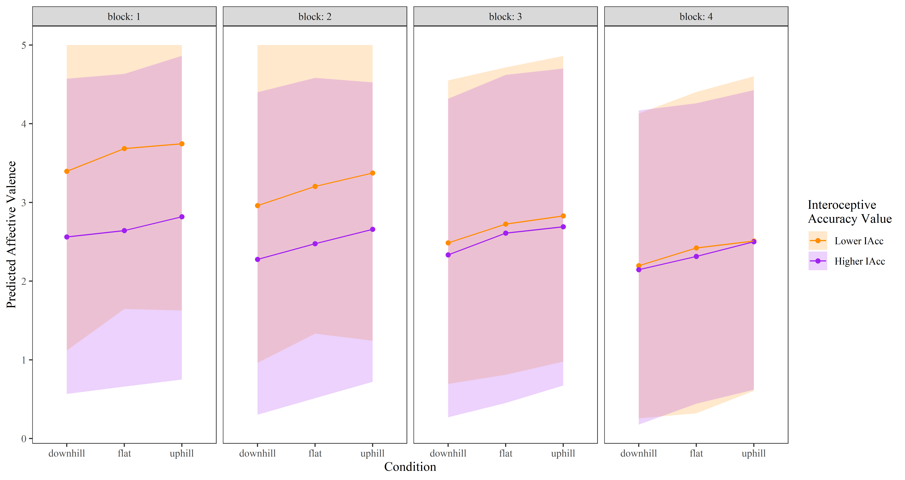
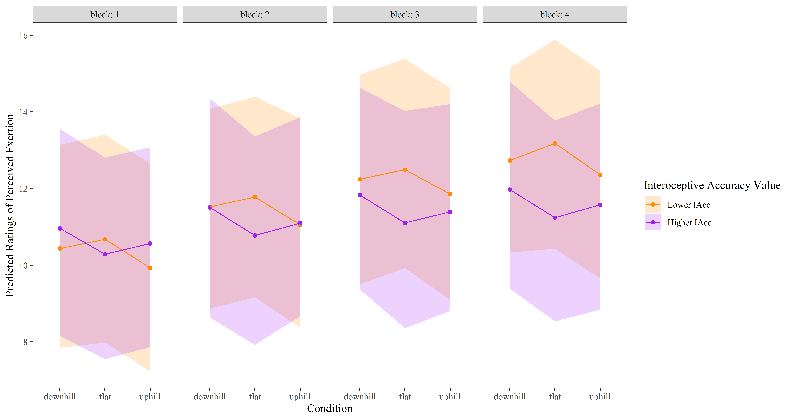

# `seefeel`
Code and data for "What I see and what I feel: The influence of deceptive visual cues and interoceptive accuracy on affective valence and sense of effort during exercise"

## Figures from paper

*Figure 3: Predicted affective valence (with 95% confidence intervals) for lower and higher interoceptive accuracy values (Lower IAcc = sample mean - SD, Higher IAcc = sample mean + SD) across visual cue conditions and blocks*.

*Figure 4: Predicted ratings of perceived exertion (with 95% confidence intervals) for lower and higher interoceptive accuracy values (Lower IAcc = sample mean - SD, Higher IAcc = sample mean + SD) across visual cue conditions and blocks*.
