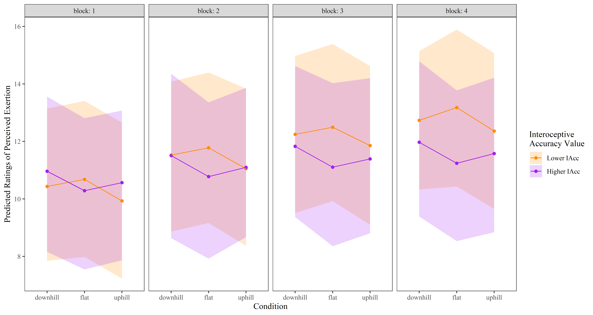

# `seefeel`

Code and data for "What I see and what I feel: The influence of deceptive visual cues and interoceptive accuracy on affective valence and sense of effort during exercise"

## How to use this repository

1. The statistical modelling undertaken in R is available here as a script: [/seefeel-analysis.R](https://github.com/tystan/seefeel/blob/main/seefeel-analysis.R)
2. As the data cannot be publicly shared, this PDF contains summary, non-identifying information of the modelling process: [/seefeel-analysis.pdf](https://github.com/tystan/seefeel/blob/main/seefeel-analysis.pdf)
    + The PDF above is generated using a Quarto document here: [/seefeel-analysis.qmd](https://github.com/tystan/seefeel/blob/main/seefeel-analysis.qmd)
3. [Figure 3](https://github.com/tystan/seefeel/blob/main/fig/figure-3.png) and [Figure 4](https://github.com/tystan/seefeel/blob/main/fig/figure-4.png) from the paper are available in the [fig/](https://github.com/tystan/seefeel/tree/main/fig) directory as PNGs (or can be seen below)

*Figure 3: Predicted affective valence (with 95% confidence intervals) for lower and higher interoceptive accuracy values (Lower IAcc = sample mean - SD, Higher IAcc = sample mean + SD) across visual cue conditions and blocks*.

*Figure 4: Predicted ratings of perceived exertion (with 95% confidence intervals) for lower and higher interoceptive accuracy values (Lower IAcc = sample mean - SD, Higher IAcc = sample mean + SD) across visual cue conditions and blocks*.
